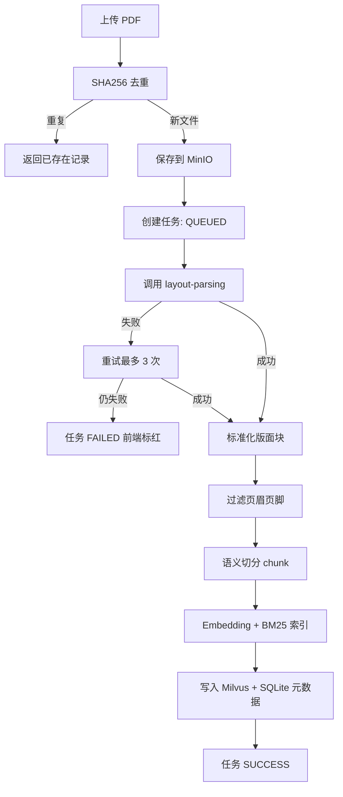
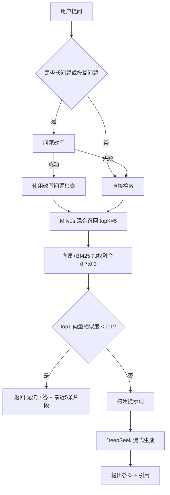
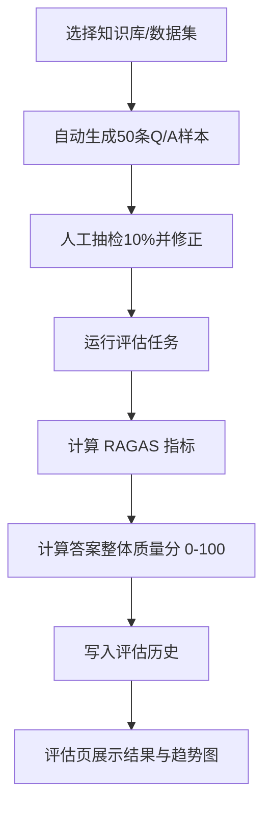

# RAG 管理系统应用流程说明 (APP_FLOW)

## 1. 流程总览
系统包含三条主流程:
1. 文档入库流程（上传 -> 解析 -> 切分 -> 索引）。
2. 在线问答流程（提问 -> 检索 -> 生成 -> 引用展示）。
3. 评估流程（构建数据 -> 执行评估 -> 展示趋势 -> 优化迭代）。

## 2. 文档入库流程

### 2.1 关键规则
1. 文件限制: 仅 PDF，单文件最大 100MB。
2. 去重: 按文件字节流做 SHA256，命中则不重复入库。
3. 解析失败重试: 3 次，失败后人工处理（前端红色状态）。
4. 过滤策略: 页眉页脚不进入检索数据。
5. 切分策略: `chunk_size=2000`、`overlap=50`（中文字符）。

## 3. 在线问答流程

### 3.1 改写触发定义
默认触发条件（可配置）:
1. 长问题: 中文字符数 >= 35。
2. 模糊问题: 命中指代词且缺少明确主题词（如“这个/那个/它/上述”且长度 < 20）。

### 3.2 引用展示定义
1. 引用格式: `[文件名-页码-段落ID]`。
2. 至少展示 1 条引用，最多展示 5 条引用片段。
3. 所有引用必须可以回溯到 chunk 元数据。

## 4. 评估流程

### 4.1 指标与目标
1. faithfulness: 0.7~0.9
2. answer_relevancy: 0.7~0.8
3. context_precision: 0.6~0.8
4. context_recall: 0.7~0.8
5. 答案整体质量分: 0~100（页面可视化）

## 5. 状态机定义
### 5.1 入库任务状态
1. `QUEUED`: 已创建，等待执行。
2. `RUNNING`: 处理中（解析/切分/索引任一环节）。
3. `SUCCESS`: 全部成功。
4. `FAILED`: 超过 3 次重试失败。

### 5.2 评估任务状态
1. `QUEUED`
2. `RUNNING`
3. `SUCCESS`
4. `FAILED`

## 6. 异常路径
1. 解析接口不可达:
- 任务进入重试队列。
- 达到最大重试后标红。
2. Embedding 接口返回异常:
- 记录错误详情。
- 当前文档任务失败并可人工重跑。
3. DeepSeek 接口超时:
- 返回错误提示并记录 trace。
4. 检索低相关:
- 触发拒答文案 `无法回答`。

## 7. 可观测性最小要求
1. 每个请求带 `request_id`。
2. 任务日志至少记录:
- file_id
- task_id
- step
- duration_ms
- error_message
3. 评估结果保留历史记录，支持趋势图查询。

