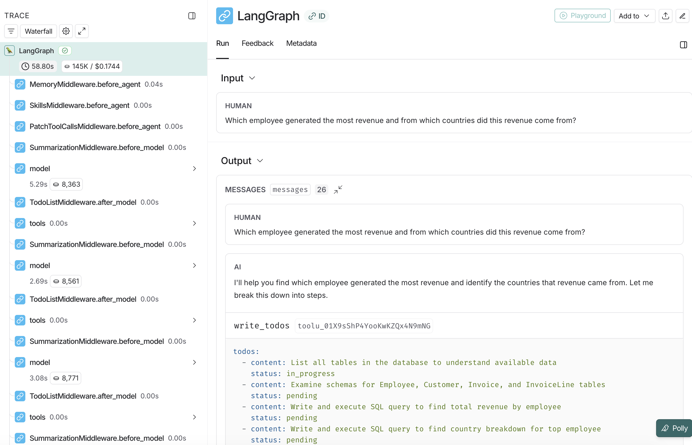

# Text-to-SQL 深度智能体

一个基于 LangChain **Deep Agents** 框架的自然语言转 SQL 查询智能体。这是 text-to-sql 智能体的高级版本，具备规划、文件系统和子智能体能力。

## 什么是 Deep Agents？

Deep Agents 是建立在 LangGraph 上的高级智能体框架，提供以下能力：

- **规划能力** - 使用 `write_todos` 工具分解复杂任务
- **文件系统后端** - 通过文件操作保存和检索上下文
- **子智能体生成** - 将专业任务委托给专注的智能体
- **上下文管理** - 防止复杂任务出现上下文窗口溢出

## 示例数据库

使用 [Chinook 数据库](https://github.com/lerocha/chinook-database) - 一个代表数字媒体商店的示例数据库。

## 快速开始

### 前置条件

- Python 3.11 或更高版本
- Anthropic API 密钥（[获取密钥](https://console.anthropic.com/)）
- （可选）LangSmith API 密钥用于追踪（[注册](https://smith.langchain.com/)）

### 安装

1. 克隆 deepagents 仓库并进入此示例目录：

```bash
git clone https://github.com/langchain-ai/deepagents.git
cd deepagents/examples/text-to-sql-agent
```

1. 下载 Chinook 数据库：

```bash
# 下载 SQLite 数据库文件
curl -L -o chinook.db https://github.com/lerocha/chinook-database/raw/master/ChinookDatabase/DataSources/Chinook_Sqlite.sqlite
```

1. 创建虚拟环境并安装依赖：

```bash
# 使用 uv（推荐）
uv venv --python 3.11
source .venv/bin/activate  # Windows 上：.venv\Scripts\activate
uv pip install -e .
```

1. 设置环境变量：

```bash
cp .env.example .env
# 编辑 .env 并添加你的 API 密钥
```

`.env` 中必须配置：

```
ANTHROPIC_API_KEY=your_anthropic_api_key_here
```

可选配置：

```
LANGCHAIN_TRACING_V2=true
LANGSMITH_ENDPOINT=https://api.smith.langchain.com
LANGCHAIN_API_KEY=your_langsmith_api_key_here
LANGCHAIN_PROJECT=text2sql-deepagent
```

## 使用方法

### 命令行界面

从命令行运行智能体，使用自然语言提问：

```bash
python agent.py "What are the top 5 best-selling artists?"
```

```bash
python agent.py "Which employee generated the most revenue by country?"
```

```bash
python agent.py "How many customers are from Canada?"
```

### 编程使用

你也可以在 Python 代码中使用智能体：

```python
from agent import create_sql_deep_agent

# 创建智能体
agent = create_sql_deep_agent()

# 提问
result = agent.invoke({
    "messages": [{"role": "user", "content": "What are the top 5 best-selling artists?"}]
})

print(result["messages"][-1].content)
```

## 深度智能体工作原理

### 架构

```
用户问题
     ↓
深度智能体（具备规划能力）
     ├─ write_todos（规划方法）
     ├─ SQL 工具
     │  ├─ list_tables
     │  ├─ get_schema
     │  ├─ query_checker
     │  └─ execute_query
     ├─ 文件系统工具（可选）
     │  ├─ ls
     │  ├─ read_file
     │  ├─ write_file
     │  └─ edit_file
     └─ 子智能体生成（可选）
     ↓
SQLite 数据库（Chinook）
     ↓
格式化答案
```

### 配置

Deep Agents 使用**渐进式披露**机制，结合内存文件和技能：

**AGENTS.md**（始终加载）- 包含：

- 智能体身份和角色
- 核心原则和安全规则
- 通用指南
- 沟通风格

**skills/**（按需加载）- 专业工作流：

- **query-writing** - 如何编写和执行 SQL 查询（简单和复杂）
- **schema-exploration** - 如何发现数据库结构和关系

智能体可以在上下文中看到技能描述，但只有当确定当前任务需要哪个技能时，才会加载完整的 SKILL.md 指令。这种**渐进式披露**模式保持了上下文的简洁，同时在需要时提供深入的专业知识。

## 示例查询

### 简单查询

```
"How many customers are from Canada?"
```

智能体将直接查询并返回数量。

### 带规划的复杂查询

```
"Which employee generated the most revenue and from which countries?"
```

智能体将：

1. 使用 `write_todos` 规划方法
2. 确定所需的表（Employee、Invoice、Customer）
3. 规划 JOIN 结构
4. 执行查询
5. 格式化结果并分析

## 深度智能体输出示例

深度智能体展示其推理过程：

```
问题：Which employee generated the most revenue by country?

[规划步骤]
使用 write_todos：
- [ ] 列出数据库中的表
- [ ] 检查 Employee 和 Invoice 的模式
- [ ] 规划多表 JOIN 查询
- [ ] 按员工和国家执行和聚合
- [ ] 格式化结果

[执行步骤]
1. 列出表...
2. 获取模式：Employee、Invoice、InvoiceLine、Customer
3. 生成 SQL 查询...
4. 执行查询...
5. 格式化结果...

[最终答案]
员工 Jane Peacock（ID：3）产生了最多的收入...
主要国家：美国（$1000）、加拿大（$500）...
```

## 项目结构

```
text-to-sql-agent/
├── agent.py                      # 核心深度智能体实现及 CLI
├── AGENTS.md                     # 智能体身份和通用指令（始终加载）
├── skills/                       # 专业工作流（按需加载）
│   ├── query-writing/
│   │   └── SKILL.md             # SQL 查询编写工作流
│   └── schema-exploration/
│       └── SKILL.md             # 数据库结构发现工作流
├── chinook.db                    # 示例 SQLite 数据库（下载后，git 忽略）
├── pyproject.toml                # 项目配置和依赖
├── uv.lock                       # 锁定的依赖版本
├── .env.example                  # 环境变量模板
├── .gitignore                    # Git 忽略规则
├── text-to-sql-langsmith-trace.png  # LangSmith 追踪示例图片
└── README.md                     # 本文件
```

## 依赖要求

所有依赖在 `pyproject.toml` 中指定：

- deepagents >= 0.3.5
- langchain >= 1.2.3
- langchain-anthropic >= 1.3.1
- langchain-community >= 0.3.0
- langgraph >= 1.0.6
- sqlalchemy >= 2.0.0
- python-dotenv >= 1.0.0
- tavily-python >= 0.5.0
- rich >= 13.0.0

## LangSmith 集成

### 设置

1. 在 [LangSmith](https://smith.langchain.com/) 注册免费账户
2. 从账户设置创建 API 密钥
3. 将以下变量添加到 `.env` 文件：

```
LANGCHAIN_TRACING_V2=true
LANGSMITH_ENDPOINT=https://api.smith.langchain.com
LANGCHAIN_API_KEY=your_langsmith_api_key_here
LANGCHAIN_PROJECT=text2sql-deepagent
```

### 你将看到什么

配置后，每个查询都会被自动追踪：



你可以查看：

- 完整的执行追踪及所有工具调用
- 规划步骤（write_todos）
- 文件系统操作
- Token 使用量和费用
- 生成的 SQL 查询
- 错误消息和重试次数

查看你的追踪：https://smith.langchain.com/

## 资源

- [Deep Agents 文档](https://docs.langchain.com/oss/python/deepagents/overview)
- [LangChain](https://www.langchain.com/)
- [Claude Sonnet 4.5](https://www.anthropic.com/claude)
- [Chinook 数据库](https://github.com/lerocha/chinook-database)

## 许可证

MIT

## 贡献

欢迎贡献！请随时提交 Pull Request。
